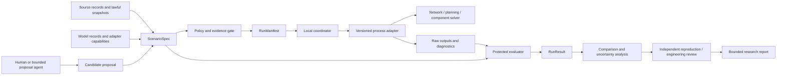
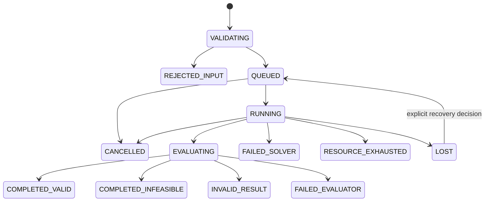

# Grid Horizons architecture

Status: **architecture foundation accepted; research runtime not implemented**. Owner: Lucas Santana. Foundation date: 2026-09-07. Acceptance evidence: [STATUS.md](STATUS.md).

## Mission and claim boundary

Grid Horizons is an offline research platform for comparing energy-system operating policies, network and component designs, generation and storage portfolios, resilience strategies, and lifecycle hypotheses under explicit models and evidence limits. Its long-term value is one traceable path from a research question to a reproducible comparison across several fidelities, without letting a persuasive agent, optimizer, or visualization redefine physical feasibility.

The first implementation is deliberately small: a local command-line programme, filesystem artifacts, one public or synthetic feeder, and one hand-checkable conservation case. The architecture preserves a route to large studies, component multiphysics, and distributed campaigns, but those capabilities are contingent outcomes rather than installed infrastructure.

The platform predicts behavior within declared model domains. It does not establish a physical design, safety case, operating instruction, or real-world benefit by itself. It has no SCADA, DERMS, EMS, protection-relay, market-bidding, or asset-actuation interface. External inputs are imported snapshots, and runs have no production network credentials.

## Protected invariants

1. **Conservation before performance.** Every coupled run closes explicit real-energy and stored-state ledgers. Reactive-power balance and other non-energy quantities remain distinct. An unexplained residual invalidates the affected comparison.
2. **Feasibility before preference.** Hard engineering and evidence constraints are evaluated before objectives. An infeasible candidate cannot compensate with lower cost, emissions, or losses.
3. **One meaning per quantity.** Values carry quantity kind, unit, sign convention, reference basis, location, and interval semantics. Power, energy, apparent power, reactive power, temperature, and emissions are never interchangeable.
4. **One canonical contract family.** All engines consume a versioned `ScenarioSpec`, each execution is fixed by a `RunManifest`, and every terminal attempt emits exactly one `RunResult`. Adapters may not create competing scenario or result formats.
5. **Evidence stays attached.** Inputs, models, transformations, solver configuration, uncertainty, failures, resource use, and rights decisions remain traceable from every comparison.
6. **Evaluation is protected.** Proposal agents and optimizers cannot change accepted constraints, evaluators, confirmation cases, or prior results.
7. **Negative results are results.** A feasible candidate that loses to baseline is valid evidence. Nonconvergence, missing output, evaluator failure, and budget exhaustion are not favorable outcomes.
8. **Fidelity is declared.** A steady-state feeder solver is not a transient electromagnetic, protection, thermal-fluid, or lifecycle model. Cross-fidelity claims require a named coupling and applicability argument.
9. **Speculation remains bounded.** Novel concepts must conserve energy and charge, use sourced parameter ranges, expose unsupported assumptions, and pass known-technology baselines before any comparative claim.
10. **Local evidence precedes scale.** Distribution is earned by measured workload or isolation pressure after local replay, cancellation, recovery, and duplicate prevention work.

## System boundaries



The coordinator owns execution state and resource accounting. Domain engines own numerical solution inside their declared model cards. Evaluators own validity and metrics. Reports interpret retained results. No layer inherits another layer's authority.

## Bounded domains

| Domain | Owns | Receives / emits | Must not decide |
| --- | --- | --- | --- |
| Evidence catalog | Source identity, retrieval date, rights, redistribution, transformations, uncertainty, lineage | `SourceRecord` and content-addressed imported artifacts | Scientific applicability or permission inferred from public access |
| Scenario and hypothesis | System boundary, horizon, exogenous inputs, baseline/candidate arms, parameters, seeds, constraints, objectives, falsifier | `ScenarioSpec` | Solver success, feasibility, or publication |
| Network operations | AC or declared approximation, topology, nodal/branch state, voltage/loading diagnostics | Boundary injections and interval-indexed network state | Component aging, long-run investment, or physical controls |
| Device and storage state | State of charge, efficiency, standing loss, tap state, bounded control actions | Power exchange and state transitions over explicit intervals | Network feasibility or lifecycle impact |
| Transformer/component physics | Electrical loss, thermal state, aging proxy, and later electromagnetic/thermal-field outputs at declared fidelity | Boundary power/loss/temperature/state with a `ModelRecord` | Whole-grid dispatch or claims outside material/model range |
| Generation and capacity planning | Capacity, dispatch, storage, resource availability, investment periods, and cost assumptions | Candidate portfolio and boundary dispatch | Distribution voltage validity or component certification |
| Reliability and resilience | Enumerated contingencies or stochastic event processes, served/unserved energy, restoration assumptions | Scenario ensemble and reliability distribution | Live response, protection settings, or universal reliability claims |
| Lifecycle | Functional unit, system boundary, construction/operation/end-of-life inventories and impact factors | Impact vector with provenance and uncertainty | Operational feasibility or unqualified cross-study equivalence |
| Search and agents | Candidate proposals, experiment coverage, hypothesis rationale, equal-budget search bookkeeping | `CandidateProposal` only | Constraints, hidden cases, evaluator code, budget, or supported claims |
| Evaluation and reporting | Validity, feasibility, objective vectors, uncertainty, comparison, evidence tier and limitations | `RunResult`, comparison set, report | Repairing a candidate or erasing failures |
| Execution control | Queueing, attempt identity, isolation, cancellation, caps, atomic publication, recovery | `RunManifest`, event journal, artifacts | Scientific truth, score direction, or external action |

Each domain has a provider-neutral interface. Engine-specific names and native files remain inside its adapter directory and `adapterConfig`. A domain model may be replaced only after its conformance cases, sign/unit mapping, error translation, and output coverage pass.

## Horizons and fidelity

A `ScenarioSpec` declares one primary decision horizon and any nested solver clocks. The following are architecture categories, not committed timestep values or claims that an engine supports them:

| Horizon | Typical question | State and time semantics | Evidence boundary |
| --- | --- | --- | --- |
| Snapshot network | Does one topology/injection state solve and satisfy limits? | Algebraic phasor state at one timestamp | No energy, dynamics, control stability, or protection claim |
| Quasi-static operation | How does a fixed policy behave across load/resource intervals? | Ordered half-open intervals `[start, end)`; network snapshots plus carried device/thermal state | No sub-interval transient claim unless a nested model supplies it |
| Fast dynamics / protection | What happens during electromechanical, electromagnetic, or protection events? | Continuous/event state and solver-specific clocks | Out of the first milestone; requires a separately validated adapter and reviewer |
| Reliability ensemble | What service outcomes follow declared outages, repair processes, and weather cases? | Event chronology or sampled trajectories with retained seeds | Scenario-conditional distribution, not a forecast of a named utility |
| Design and capacity | Which portfolios or components are feasible over representative periods and investment epochs? | Representative snapshots or chronological periods with explicit weights and boundary-state rules | Approximation error and omitted chronology must be reported |
| Component physics | How do geometry, material, electrical loss, temperature, cooling, and aging interact? | Model-specific spatial/temporal discretization with convergence evidence | No certification; material range and boundary conditions limit transfer |
| Lifecycle | What burdens occur over construction, operation, maintenance, and end-of-life? | Inventory stages tied to a functional unit and service life assumption | Results depend on system boundary, allocation, geography, and source vintage |

Operational variables cannot silently become design variables. An operating study holds asset design/capacity fixed unless explicitly declared; a design study emits a design candidate that must be replayed through operational and reliability evaluators. Representative-period weights are metadata for aggregation, never elapsed time for state propagation unless the model explicitly defines that mapping.

## Canonical contracts

Contracts use JSON-compatible data, explicit schema versions, stable human-readable identifiers, and closed execution fields. Unknown fields under execution-critical objects are rejected. Extensible descriptive metadata lives in a namespaced `annotations` object and is never executable.

### `SourceRecord`

- source ID, title, publisher, canonical URL, exact release/version/date, retrieval date, and artifact digest;
- author/licensor, license or terms URL, attribution, access conditions, permitted use, modification and redistribution decision;
- original quantity/unit/sign conventions, coverage, uncertainty/quality notes, transformations with tool/version and parent IDs;
- rights state: `CLEARED_REFERENCE`, `CLEARED_REDISTRIBUTION`, `REVIEW_REQUIRED`, or `REJECTED`.

An artifact marked `REVIEW_REQUIRED` may support source evaluation but cannot be bundled or published. A URL or repository license does not automatically settle the rights of every included model or dataset.

### `ModelRecord`

- model and adapter ID/version, governing equations or reference, solver and relevant transitive versions;
- variables, units, signs, supported domains/ranges, boundary/initial conditions, fidelity and omitted physics;
- calibration evidence, verification cases, independent validation cases, discretization/convergence evidence where applicable;
- numerical controls, expected diagnostics, invalid states, checkpoint capability, platform evidence and prohibited interpretations.

Engine capability and model applicability are separate. An engine may be legally usable and runnable while a bundled feeder, material table, or parameterization remains unreviewed.

### `ScenarioSpec`

The single scientific input contract contains:

- question and falsifiable hypothesis;
- system and geographic boundaries, primary horizon, timeline/calendar/time zone, intervals and coupling clocks;
- source/model references and immutable input artifact references;
- topology, assets, exogenous profiles, initial/boundary states, baseline and candidate definitions;
- decision variables with units and bounds; declared seeds and scenario ensemble rules;
- hard constraints, objective vector with direction/unit/aggregation, uncertainty method, confirmation-case policy;
- adapter allowlist and resource envelope; prohibited interpretations and stop conditions.

Scenario identity changes whenever an execution-relevant field changes. A report never compares arms that differ in supposedly controlled fields without labeling the difference.

### `RunManifest`

The single execution contract binds one accepted scenario and one arm to:

- logical run ID and unique attempt ID;
- repository revision, scenario version, adapter/model/engine versions and input artifact identities;
- actual seed, numerical settings, threads, runtime/OS/architecture and declared hardware features;
- scratch/output paths and wall-time, CPU, memory, disk, subprocess, parallelism, network and inference-cost caps;
- requested start, cancellation policy and expected outputs.

Retries retain the logical run ID, receive a new attempt ID, and never overwrite a published terminal result. Hardware support is recorded only after exercising that exact environment.

### `RunResult`

Every attempt ends with one envelope containing:

- manifest reference, terminal state, timestamps, resource accounting and whether caps were enforced or only observed;
- raw artifact index, stdout/stderr/diagnostics, solver status and evaluator version;
- quantity-valued metrics, uncertainty, hard-constraint findings, conservation ledgers and coverage/completeness;
- feasibility, comparison eligibility, limitations, and links to retained partial artifacts;
- provenance for every derived metric and a clear distinction among source fact, assumption, simulation prediction, measured software performance, and reviewer interpretation.

Only `COMPLETED_VALID` results enter objective comparisons. `COMPLETED_INFEASIBLE` is valid evidence about a candidate but is excluded from the feasible Pareto set.

## Units, clocks, and conservation across solvers

The contract follows SI quantity dimensions: seconds for computational time intervals, watts for real power, vars for reactive power, volt-amperes for apparent power, joules for canonical energy accounting, kelvins for thermodynamic calculations, and explicit display conversions such as hours, kW, kWh, or degrees Celsius. Per-unit values always include their base quantities. Currency and emissions include currency year, geography, mass species/equivalence basis, and functional unit.

Each interval is half-open and has an exact duration. Adapter boundaries carry `quantityKind`, `value`, `unit`, `signConvention`, `basis`, `location`, `intervalStart`, `intervalEnd`, and aggregation semantics (`instantaneous`, `mean`, `integral`, `minimum`, `maximum`, or `state_end`). Native solver floats are allowed, but conversions occur once at named adapter boundaries and are tested with a round-trip and sign-control case.

For every coupled macro-step, the electrical boundary ledger records only energy that actually crossed the electrical boundary or remained in modeled electrical storage:

```text
E_stored,start + E_import + E_generation,injected
= E_stored,end + E_export + E_load,served + E_loss,dissipative + E_dump,electrical + residual
```

`E_generation,available` is counterfactual resource potential after the scenario's declared conversion assumptions; it is not an electrical injection. Curtailment is reported as `E_generation,available - E_generation,injected` when those quantities share a basis, and it stays outside the electrical conservation equation. Likewise, primary-energy or water spillage belongs to its own resource/mass ledger unless it first became electrical energy and was then sent to a real dump sink. This prevents curtailed energy that never entered the network from being subtracted a second time.

Tiny boundary example: during one hour, a PV model makes `10 kWh` available, curtails `4 kWh`, and injects `6 kWh`. A load receives `5 kWh` and network losses dissipate `1 kWh`. With no storage, import, export, or dump, the electrical ledger is `0 + 0 + 6 = 0 + 0 + 5 + 1 + 0`; curtailment is separately `10 - 6 = 4 kWh`. Writing `6 - 4` in the electrical balance would be wrong.

The ledger is partitioned by asset and boundary so cancellation errors cannot hide inside a system aggregate. Reactive balance, charge balance, mass/material inventories, primary-resource potential, and thermal storage use separate ledgers as applicable. Tolerances are supplied by the accepted model/benchmark from source precision and numerical analysis; the architecture supplies no universal threshold.

Coupling uses an explicit master algorithm. At each communication point it declares input hold/interpolation, output sampling/integration, event ordering, state transfer, and whether feedback is one-way or iterated. Algebraic loops require a declared iteration method, convergence condition, maximum iterations and failure result. A solver that returns early, misses a communication point, loses state, or cannot honor the requested step produces a structured failure; the coordinator must not interpolate success. FMI is a useful interoperability reference, but adopting FMI or a co-simulation framework is a later measured decision, not a foundation dependency.

## Evaluation: validity, feasibility, Pareto comparison, uncertainty

Evaluation proceeds in this order:

1. **Completeness:** expected intervals, variables, diagnostics and artifacts exist.
2. **Numerical validity:** solver status, convergence/discretization requirements, finite values and residual checks pass.
3. **Contract validity:** units, signs, topology references, bounds and conservation ledgers pass.
4. **Applicability:** every value and state stays inside its model's supported domain or is marked out-of-domain.
5. **Feasibility:** all hard electrical, thermal, storage, reliability, lifecycle and resource constraints pass.
6. **Objectives:** compute the declared vector only for comparison-eligible runs.
7. **Uncertainty and sensitivity:** propagate declared input/model/numerical uncertainty and expose assumptions that change feasibility or ranking.
8. **Comparison:** publish feasible non-dominated candidates plus dominated, infeasible, failed and ambiguous cases with reasons.

The platform never folds feasibility into a weighted score. Pareto dominance compares aligned objective definitions, directions, units, boundaries, periods and uncertainty treatment. When uncertainty intervals or ensembles do not support a stable ordering, the relationship is `INDETERMINATE`; the nominal point estimate remains visible but is not promoted as a robust winner. Any scalar preference function is a separately versioned human decision and cannot erase the objective vector.

Calibration, verification, validation, and confirmation remain separate:

- **Code/contract verification:** implementation matches the declared equations, schema and invariants.
- **Numerical verification:** known-answer, reference, refinement or cross-solver cases bound implementation/discretization error.
- **Calibration:** uncertain model parameters are fit on declared development evidence only.
- **Validation:** predictions are compared with independent observations or authoritative references for a stated use and range.
- **Confirmation:** selected candidates are evaluated on reserved scenarios not used for tuning.
- **Engineering review:** a qualified person judges applicability, feasibility and interpretation; this remains unresolved until such a reviewer accepts the work.

Passing one rung does not imply another. Repeated access to a confirmation set moves it into development evidence and requires a new confirmation plan.

## Protected evaluator and agent boundary

Proposal agents receive public source summaries, development scenarios, allowed parameter schemas, previous public results and a resource budget. They emit `CandidateProposal` records containing rationale, source assumptions, parameter changes, expected mechanism, falsifier and requested runs. They receive no write access to evaluator code, accepted scenario constraints, confirmation inputs, source-rights decisions, results, or resource-policy configuration.

The evaluator runs from a reviewed revision and recalculates metrics from raw outputs rather than trusting adapter or agent summaries. A read-only directory or different process identity alone is not an isolation boundary: the same OS user can often inspect mounts, processes, environment variables, sockets, caches, or credentials.

Trusted built-in proposal logic and transparent development fixtures may run in the initial local process while the project is establishing contracts. Before any untrusted candidate code, plugin, serialized executable model, or agent tool is executed—or before protected confirmation inputs exist—the runner must enforce an approved OS account, sandbox, container, or VM boundary that provides:

- filesystem isolation: no evaluator source, confirmation inputs, unrelated repository paths, host secrets, or prior protected results are mounted or readable;
- credential isolation: an empty/minimal environment and no inherited browser, cloud, SSH, package-registry, signing, or personal credentials;
- default-deny network policy with only an explicitly reviewed endpoint allowlist when a task truly requires network access;
- enforced CPU, memory, wall-time, disk, process/subprocess, device and output-size limits, plus termination of the complete process tree;
- a narrow declarative input contract and artifact-only output channel, with evaluator execution occurring in a separate trusted boundary;
- recorded sandbox policy/version and evidence that representative filesystem, credential, network, and resource escape attempts fail.

If the allocated platform cannot enforce those properties, untrusted execution and protected confirmation are blocked. The project may continue only with reviewed built-ins and non-secret development fixtures. Evaluator changes invalidate affected evidence after impact analysis and require a regression control that would have failed under the old defect. Agents may explain results, but explanations are untrusted report inputs.

## Execution lifecycle, failure, and recovery



Terminal categories are never collapsed into a score. `REJECTED_INPUT` means the run never began; `FAILED_SOLVER` means no valid scientific result; `RESOURCE_EXHAUSTED` preserves partial diagnostics and actual usage; `INVALID_RESULT` records a completed numerical attempt that fails evidence rules; `COMPLETED_INFEASIBLE` is a valid evaluation of an infeasible candidate; and `COMPLETED_VALID` may still refute the hypothesis.

The local coordinator appends state events durably, launches adapters with argument arrays, and writes each attempt into a unique temporary directory. Publication validates the result envelope and atomically renames the directory. A completed attempt is immutable. Cancellation first requests cooperative stop, then terminates the subprocess tree within the declared policy, records incomplete accounting honestly, and never publishes a partial success.

On restart, the coordinator reconciles journal state, process liveness, scratch directories, caps and publication targets. Unknown process ownership becomes `LOST`; it is never silently retried. A recovery decision either attaches diagnostics, marks terminal loss, or queues a new attempt. Scheduling is feasibility-aware: reject runs whose declared minimum cannot fit the campaign envelope, cap concurrent CPU/memory/disk, apply fair queue order within a campaign, and stop launching work after cancellation or exhausted budget.

Workers receive a read-only accepted input bundle, pinned adapter environment, bounded scratch space and a narrow artifact output directory. Network is denied after lawful input preparation. Personal credentials, arbitrary serialized objects, unreviewed plugins, unrestricted paths and shell-composed commands are prohibited. These logical rules supplement rather than replace the enforced isolation required before untrusted or protected-confirmation work.

## Local-first implementation and scale triggers

The starting shape is a language-version decision followed by a standard-library contract validator, a local CLI, process adapters, filesystem bundles and focused tests. Python remains the leading coordinator candidate because the planned numerical ecosystem is Python-accessible, but the exact runtime and packages are unresolved until GH-002 reviews compatibility, licenses, transitive behavior and supported hardware. The architecture does not approve pandapower, PyPSA, SimBench, OpenDSS, FMI, HELICS, a finite-element engine, or any optimizer.

Add persistence or distribution only after evidence identifies a constraint:

| Possible change | Required measured trigger | Preconditions |
| --- | --- | --- |
| SQLite journal/queue | Filesystem event replay or multi-run querying is measurably unreliable or costly | Schema migration/recovery test and single-writer semantics |
| Local worker pool | Independent runs dominate elapsed time and one worker leaves approved CPU/memory idle | Per-worker caps, cancellation, deterministic attempt identity and duplicate prevention pass |
| Larger array/artifact format | CSV/JSON parsing, size, precision or memory is measured as a material bottleneck | Rights, portability, schema evolution and inspection path reviewed |
| FMI/HELICS-style co-simulation | At least two validated adapters need negotiated clocks/events that the local coupling contract cannot reliably express | Reference conformance cases and failure/recovery semantics pass |
| Remote/distributed execution | Approved workloads cannot meet documented turnaround or isolation needs on the allocated local environment | Explicit budget/credentials approval, artifact transfer integrity, remote cancellation, retry/idempotency and cost reconciliation pass |
| Service split | Independent scaling, security isolation or ownership boundaries are demonstrated in operating evidence | Stable contracts, observability, migration and rollback plan |

No trigger is a predetermined numeric threshold. GH-020 must record the baseline workload, bottleneck, expected benefit, failure cost and rollback before changing topology. Kubernetes, workflow platforms, message brokers, vector databases and cloud schedulers are absent until a measured requirement selects them.

## Repository boundaries

```text
src/contracts/          canonical scenario, run, result and source/model records
src/coordinator/        local lifecycle, scheduling, caps, cancellation and recovery
src/evaluation/         protected invariant, feasibility, objective and uncertainty evaluation
src/coupling/           explicit clocks, boundary quantities and conservation ledgers
src/reports/            evidence-bound comparisons and exports
src/{search,agents}/    later candidate generation only
src/lifecycle/          later lifecycle inventory and impact boundary
adapters/               engine-specific process adapters, one domain per boundary
scenarios/              lawful public references or redistributable/synthetic inputs
benchmarks/             known-answer, numerical verification and reserved confirmation cases
docs/                   decisions, model/source records, benchmark and review evidence
apps/workbench/         later local inspection interface
runs/                   ignored local execution artifacts
tools/                  repository-plan and later development utilities
```

These are intended ownership seams. Only documentation and the plan validator exist after Wave 0. A common library is extracted only after two implementations exhibit the same stable contract.

## Ambitious research endgame

After the eight-wave preview is independently reproduced, Grid Horizons may grow into a layered energy research programme:

- link unbalanced distribution operations to transmission/capacity scenarios without confusing their resolutions or authorities;
- compare flexible demand, storage, conversion and generation portfolios under chronological stress and lifecycle scarcity;
- connect reduced-order transformer thermal models to validated electromagnetic and thermal-field studies with uncertainty transfer;
- build reliability ensembles that expose which infrastructure and restoration assumptions drive service outcomes;
- maintain an evidence graph from source and model records through feasible Pareto fronts, negative results and replication;
- let bounded agents search hypotheses across domains while protected evaluators and qualified reviewers retain scientific authority.

Each expansion needs a new use contract, source rights, model applicability, verification/validation plan and measured resource envelope. The endgame is a credible laboratory for discovering tradeoffs, not a universal digital twin or autonomous grid operator.

## Architecture risks and replan triggers

| Risk | Early signal | Response |
| --- | --- | --- |
| Benchmark/model rights block redistribution | Terms are absent, incompatible, or asset-specific | Reference externally, seek qualified review, or use a labeled synthetic fixture |
| Solver adapters disagree | Sign/unit mapping or reference outputs diverge | Freeze search; isolate contract, model, or solver error before comparison |
| Coupling creates energy | Residual localizes at a boundary or changes with macro-step | Reduce step/refine coupling, repair state transfer, or restrict the model |
| Calibration consumes validation evidence | A supposedly held-out case influences parameters or selection | Relabel it development evidence and reserve a new confirmation set |
| Pareto ranking is unstable | Candidate order changes across plausible uncertainty or holdouts | Report ambiguity; collect discriminating evidence or avoid selection |
| Component fidelity is unsupported | Missing material data, convergence evidence or boundary measurements | Keep reduced-order scope; do not make component-design claims |
| Compute architecture grows ahead of need | More operational code than scientific execution evidence | Cut orchestration first and return to the local vertical experiment |
| Agents optimize evaluator artifacts | Gains vanish under protected recalculation or confirmation | Preserve failure, repair evaluator isolation, and rerun affected evidence |

If reduced-order predictions disagree with the accepted reference beyond predeclared tolerances, repair or restrict the model before search. If a gain disappears under confirmation load/weather, publish the negative result. High-fidelity component work waits for reusable inputs and qualified engineering review.

## Decisions still open

- Exact first feeder/model and whether its terms permit redistribution in this AGPL repository.
- Exact Python/runtime and numerical engine versions, transitive dependencies and exercised hardware/platform support.
- First profile source, including whether observed data are lawfully reusable; a synthetic profile remains the safe fallback.
- Engineering values for voltage/loading, numerical, conservation and thermal tolerances.
- Availability and scope of qualified power-system, transformer, lifecycle and safety review.
- Allocated local hardware, campaign resource limits, paid compute and agent-inference budget.

Wave 0 does not decide these. It makes their authority, evidence, and blocking effect explicit so [GH-001](docs/work-packets/GH-001.md) can resolve the first benchmark decision without guessing.
