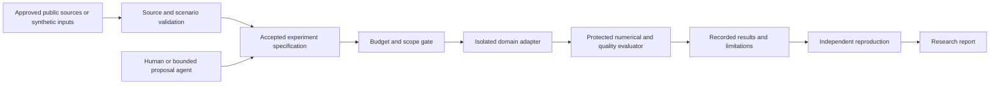

# Grid Horizons architecture

Status: proposed design, no implementation. Owner: Lucas Santana. Version: initial plan, 2026-09-07.

## Scientific boundary and adapters

Use a Python coordinator with a network adapter for steady-state/time-series power flow and a separate planning optimizer. Couple transformer thermal state through a declared timestep and loss interface, not by treating a network model as an electromagnetic finite-element solver. High-fidelity component simulation is a later replaceable process adapter with its own calibration and mesh-convergence tests. All external inputs are imported snapshots. The system has no SCADA, protection-relay or real asset actuation path.

Evaluate pandapower for the initial distribution benchmark and PyPSA for later system planning. Begin transformer thermal modeling with a documented reduced-order model. Compare any future finite-element tool with that baseline before adoption; no engine is installed by this planning repository.

Referenced engines are candidates for a version-specific evaluation, not installed or approved production dependencies. Wave 1 records the exact official source/version/license, maintenance and advisory review, runtime/transitive behavior, telemetry/data implications, alternatives and rollback before adoption. Prefer the smallest viable local stack; do not introduce Kubernetes, a vector database, a workflow platform or a model provider merely to create infrastructure.

## Experiment flow



This diagram describes the planned system. A producer cannot edit its evaluator, overwrite accepted results or extend its own budget. Source text and model output are untrusted data, never permission to execute code or change project rules.

## Components and ownership

| Component | Owns | Does not own |
| --- | --- | --- |
| Input catalog | Exact public source reference, date/version, license, units and permitted transformations | Silent data scraping or access to private records |
| Scenario contract | Inputs, supported ranges, initial/boundary conditions, comparison arms and seeds | Numerical claims outside the model card |
| Coordinator | Scheduling, state transitions, cancellation and resource accounting | Scientific truth or automatic publication |
| Domain adapter | Engine-specific conversion, execution and raw diagnostics | Metric definitions and permission changes |
| Evaluator | Predeclared invariants, metrics, holdouts and invalidity decisions | Editing the candidate to make it pass |
| Artifact store | Immutable completed run bundles and explicit partial/failed results | Personal credentials or hidden data copies |
| Report/workbench | Inspectable comparisons, uncertainty, limitations and source links | Invented outcomes or unlabeled simulations |

Use a local Python command-line coordinator and filesystem bundles first. SQLite is appropriate when durable multi-run scheduling becomes necessary. Keep JSON for contracts and small metadata, CSV for simple numeric tables, and introduce a larger-array format only when the data warrants it. Numerical engines may use C/C++ or other languages behind process adapters. Select exact language/runtime versions in the first implementation task after compatibility checks.

## Planned repository map

```text
src/                 coordinator, contracts, evaluation and reports
adapters/            independently testable domain engines
scenarios/           lawful public or synthetic scenarios
benchmarks/          fixed numerical references and confirmation cases
tests/               behavior, failure and boundary checks
apps/workbench/      later local comparison interface
docs/                domain decisions and scientific interpretation
```

These directories are proposed owned scopes, not existing software. The project starts as documentation only. Early tasks establish an actual runnable skeleton and exact verification commands before downstream implementation begins.

## Shared data contracts

- `SourceRecord`: human-readable ID, provider URL, version/date, license, permitted use, transformations, coverage, quality limitations and whether redistribution is allowed.
- `ModelCard`: engine/version, governing assumptions, variables/units, supported ranges, calibration evidence, validation cases, numerical tolerances, invalid states and prohibited interpretations.
- `ExperimentSpec`: ID, question, model/scenario versions, source references, parameters, seeds, baseline/candidate, metrics, quality constraints, acceptance/falsification rule, allowed adapter and compute/storage limits.
- `RunResult`: spec ID, repository commit, environment, actual seed, start/end, raw artifact paths, diagnostics, measured/modelled status, metrics, uncertainty, cost and terminal state.
- `ResearchClaim`: exact statement, supporting and contradicting run/source references, applicability, limitations, reproduction status and reviewer decision.

The persisted contract uses explicit schema versions and rejects unknown execution fields. Units are machine-readable and must be converted at a named boundary. A run records seeds, solver settings, thread count, hardware and tolerances: stochastic reproducibility and floating-point equivalence are distinct from bitwise determinism.

## Execution and recovery

Lifecycle: `PROPOSED -> ACCEPTED -> QUEUED -> RUNNING -> EVALUATED -> REPLICATED` with `REJECTED`, `INVALID`, `FAILED` and `CANCELLED` terminal alternatives. A low score is a valid negative result; a numerical failure is invalid evidence and must not become a favorable score.

Write outputs into a run-specific temporary directory and publish the result atomically only when required outputs validate. Preserve partial diagnostics after interruption. Retries use the same logical run ID and cannot overwrite a completed result. At restart, reconcile running subprocesses, recorded costs and worker ownership before scheduling. Cancellation must terminate the subprocess tree and mark its artifacts and cost state explicitly.

Workers receive only the accepted scenario, pinned engine environment and bounded scratch/output locations. Deny network by default after input preparation, omit personal credentials and limit CPU/GPU time, memory, disk and subprocess count. Use process argument arrays rather than shell interpolation. Model weights and serialized objects require safe loading; no arbitrary remote-code trust. Separate contributor code from evaluator and release credentials.

## Evaluation and domain invariants

Delivered energy, real/reactive balance residuals, energy losses, voltage violations, transformer thermal-limit exposure, unserved energy, curtailment, cost assumptions and operational/lifecycle emissions. Report uncertainty, infeasibility and solver status; never equate nameplate power with energy or efficiency.

Enforce declared units, power versus energy distinctions, passive losses and conservation. Public/synthetic infrastructure only; exclude restricted network topology, credentials, live grid controls and instructions for sabotage. Optimization cannot relax engineering limits to improve a score. Novel energy concepts must obey established conservation and include plausible parameter provenance.

Tolerances are justified from numerical analysis, source precision or a domain reference before candidate search. Calibrate on development evidence and confirm on reserved cases. Save all candidate attempts, including failure, and report comparison uncertainty; do not tune repeatedly against a supposedly independent final holdout.

## Scale and integration decisions

Prove one local experiment first. Add batch workers only after replay, cancellation and duplicate prevention pass; add distributed runs only when measured elapsed time justifies the complexity. No cloud resource is provisioned by this plan. Future Tanduna contributions remain ordinary reviewed GitHub changes. An optional Research Continuum integration uses versioned experiment contracts and cannot bypass this project's evaluator or safety policy.

## Risks and cut order

If reduced-order predictions disagree with the reference beyond predeclared tolerances, repair or restrict the model before search. If a claimed efficiency gain disappears under held-out weather or load, publish that negative result. Defer high-fidelity component design until its input data and expert review exist.

Cut photorealism and polished dashboards first, distributed execution second, and additional scientific domains third. Preserve the first reproducible experiment, source rights, evaluation integrity and bounded claims. Revisit architecture only when a measured limitation or failed benchmark justifies it.
