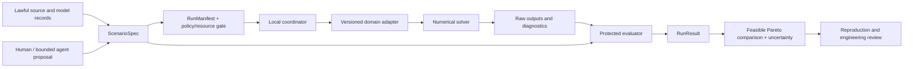

# Grid Horizons

**Simulate better grids, transformers, and energy systems before proposing physical changes.**

Grid Horizons is an open, offline research laboratory for discovering energy-system tradeoffs across distribution networks, transformer/component physics, generation and storage portfolios, resilience, and lifecycle impacts. It is designed to keep every promising result attached to its physical assumptions, numerical model, uncertainty, resource use, data rights, and failure evidence.

Created and maintained by **Lucas Santana** ([thepianistdirector](https://github.com/thepianistdirector)). [Tanduna project](https://tanduna.com/p/grid-horizons) · [Public repository](https://github.com/thepianistdirector/grid-horizons)

> **Architecture foundation completed.** The three Wave 0 tasks are **DONE**: the architecture contract, outcome/dependency roadmap, and executable next-work packet with a standard-library plan validator. The original 24 scientific/build tasks remain **PLANNED**. No simulator, model integration, application, autonomous research runtime or scientific result is implemented. Acceptance and reproduced checks are recorded in [STATUS.md](STATUS.md).

## The opportunity

Energy research often separates decisions that interact in reality: feeder operation from storage degradation, transformer loading from thermal aging, capacity planning from local voltage feasibility, reliability from lifecycle burden, and optimization from model uncertainty. Grid Horizons aims to connect those domains through explicit boundaries rather than one opaque universal model.

The long-term platform should let researchers ask questions such as:

- Which storage and tap policies reduce losses without creating voltage, loading, thermal, or state-of-charge violations?
- Which generation/storage portfolios remain feasible when chronological stress, component limits, and lifecycle assumptions are included?
- Which transformer material, cooling, or geometry hypotheses deserve higher-fidelity study after reduced-order screening?
- Which reliability improvements survive alternate outage, repair, load, and weather assumptions?
- Which candidates are truly non-dominated once uncertainty and failed runs remain visible?

Agents may propose hypotheses and improve coverage. Numerical engines solve declared models. Protected evaluators decide validity and feasibility. Qualified people retain authority over model applicability, engineering interpretation, publication, and any physical action.

## First useful experiment

The first milestone is one small, lawfully reusable public or fully synthetic distribution feeder with load and solar profiles. It will compare a fixed operating baseline with bounded storage scheduling and transformer tap strategies under identical inputs, then reject candidates that violate accepted voltage, loading, storage, model-domain, or energy-conservation constraints.

The exact feeder, profile, engine, engineering limits, and numerical tolerances are unresolved. [GH-001](docs/work-packets/GH-001.md) begins with an auditable benchmark selection rather than assuming a public download can be redistributed or a solver's example is authoritative.

## Architecture in one view



Three canonical contracts hold the system together:

- `ScenarioSpec` fixes scientific meaning: boundary, horizon, sources/models, inputs, arms, units, constraints, objectives, uncertainty, resource envelope, and falsifier.
- `RunManifest` fixes one execution: source revision, scenario arm, adapter/engine configuration, seed, environment, hardware evidence, and enforced caps.
- `RunResult` fixes one terminal attempt: diagnostics, raw artifacts, conservation ledgers, constraint findings, uncertainty, resource use, terminal state, and comparison eligibility.

Adapters translate engine-specific units, signs, clocks, statuses, and files at one boundary. They do not redefine the scenario or result. Coupled solvers exchange values only at declared communication points with explicit interpolation/hold, event ordering, state transfer, and conservation accounting.

Read [the architecture](ARCHITECTURE.md) for domain ownership, operational/design horizons, contracts, failure semantics, evaluator isolation, recovery, and scale triggers.

## Scientific rules

- Real electrical energy reconciles actual imports and generation injection against exports, served load, dissipative/dump sinks, and stored-state change. Available-but-curtailed generation never entered the network and is a separate potential metric. Reactive power and other conserved quantities have separate ledgers.
- Power, energy, apparent/reactive power, temperature, emissions, currency, and per-unit values carry explicit units and bases.
- Hard feasibility gates run before objectives. An engineering violation cannot be traded for a better weighted score.
- Comparisons retain the full objective vector. Overlapping uncertainty or reversed holdout ranking is reported as indeterminate.
- Code verification, numerical verification, calibration, physical validation, confirmation, independent reproduction, and qualified engineering review are different evidence rungs.
- A low-performing feasible candidate is a valid negative result. Nonconvergence, missing output, evaluator failure, and resource exhaustion are not scores.
- Speculative energy concepts must obey conservation, source plausible parameter ranges, and remain hypotheses until relevant evidence exists.

The platform has no live grid-control, SCADA, DERMS, EMS, protection, market-bidding, or asset-actuation path. Public/synthetic infrastructure only; no credentials, private utility topology, controlled infrastructure information, or unrestricted network/filesystem access enter a run. Untrusted candidate/plugin/agent execution and protected confirmation stay blocked until OS/container/VM filesystem, credential, network and resource isolation passes representative denial checks.

## Research domains and horizons

The planned laboratory separates:

- snapshot and quasi-static distribution-network analysis;
- carried device, storage, transformer thermal, and degradation state;
- resilience and reliability scenario ensembles;
- generation, storage, conversion, and capacity design;
- higher-fidelity electromagnetic/thermal component studies;
- lifecycle inventories and impact comparisons;
- bounded hypothesis/search agents and independent evaluation.

Fast dynamics, protection behavior, detailed multiphysics, and lifecycle claims require separate models and evidence. A steady-state power flow never silently stands in for those domains. Operating policies keep installed designs fixed; design candidates must be replayed through operational and reliability evaluation before comparison.

## Local beginning, measured scale

The first implementation should be a local command-line programme with filesystem bundles, process-isolated adapters, protected evaluation, and focused tests. Python is the leading coordinator candidate, but no runtime or package is approved. GH-002 must review exact releases, licenses, transitive/native dependencies, safe loading, diagnostics, platform/hardware behavior, alternatives, and rollback before installation.

SQLite, local worker pools, larger artifact formats, co-simulation frameworks, remote workers, and service splits are later options. Each needs a measured local bottleneck or isolation requirement plus replay, cancellation, recovery, resource accounting, duplicate prevention, and an approved operating budget. The architecture does not preselect microservices, Kubernetes, a workflow platform, a broker, a vector database, or cloud compute.

## Programme

| Wave | Outcome | Evidence gate |
| --- | --- | --- |
| 0 | Architecture and research-programme foundation | Contracts, roadmap, task graph, executable next packet, and plan validator are accepted. |
| 1 | Benchmark and engineering contract | First feeder, inputs, source rights, metrics, and constraints are fixed. |
| 2 | Network and component adapters | Power flow and transformer state are independently verifiable. |
| 3 | First efficiency experiment | A feeder comparison completes from accepted input to evidence-bound report. |
| 4 | Reliability and uncertainty | Reported gains survive meaningful reserved stress conditions. |
| 5 | Generation and transformer research | The lab crosses planning and component domains with separate fidelity gates. |
| 6 | Agent-guided engineering search | Agents improve coverage under equal budgets and protected evaluators. |
| 7 | Workbench and bounded compute | Contributors inspect, cancel, recover, and reproduce simulations. |
| 8 | Independent preview validation | A second network and qualified review support a bounded research preview. |

Wave numbers 1–8 and the original 24 task IDs, acceptance criteria, dependency edges, and scientific gates remain intact. Wave 0 prepends exactly three foundation tasks: `GH-F01`, `GH-F02`, and `GH-F03`. See the [outcome roadmap](ROADMAP.md), [task contracts](TASKS.md), and [machine-readable plan](plan/tasks.json).

## Current state and next work

The three Wave 0 tasks are `DONE`, accepted by the authorized root reviewer. The 24 original tasks remain `PLANNED`. [STATUS.md](STATUS.md) is the mutable state authority; task documents state contracts and must not be used to inflate evidence.

After foundation acceptance, the next eligible packet is [GH-001: choose a public feeder and metrics](docs/work-packets/GH-001.md). It has exact inputs, owned paths, decision matrix, acceptance evidence, failure cases, checks, stop conditions, and a safe synthetic fallback. It installs nothing and downloads nothing without separate authority.

Run the present documentation/plan check with:

```sh
python3 tools/validate_plan.py
python3 -m unittest tools/test_validate_plan.py
```

The first command validates the Wave 0 chain, DAG, markdown/JSON consistency, navigation, and evidence/state rules. The regression suite proves malformed roots, types and dependencies fail cleanly and that a properly evidenced foundation `DONE` transition remains valid. Historical preservation of the original 24 tasks is checked against revision `7256b05c0ea6e37578b93a84292d4d9bb2f7b49d` during foundation review. Neither command is a simulator test.

## Evidence and rights

[SOURCES.md](SOURCES.md) records primary and official references for SI quantity semantics, co-simulation, V&V, distribution benchmark candidates, numerical engines, transformer thermal guidance, reliability, storage, and lifecycle analysis. Every adopted input needs an exact `SourceRecord` with publisher, release, rights, attribution, transformations, uncertainty, and redistribution state.

Current candidate rights and platform facts are deliberately incomplete:

- IEEE PES feeder asset redistribution is unresolved.
- SimBench documents ODbL/Database Contents License terms, but exact bundle and AGPL obligations need qualified review.
- pandapower and PyPSA software licenses are identified, while exact versions, transitive solvers, platform/hardware support, and model applicability remain unresolved.
- No finite-element/component engine has been selected.
- Qualified power-system, transformer, lifecycle, and safety reviewers are not allocated.

Public availability is not redistribution permission. Third-party data, models, standards, papers, and code retain their own terms and are not relicensed by this repository.

## Contributing

Start with [CONTRIBUTING.md](CONTRIBUTING.md), then read [STATUS.md](STATUS.md), the accepted task, [ARCHITECTURE.md](ARCHITECTURE.md), [EXPERIMENTS.md](EXPERIMENTS.md), and the relevant source records. Bind implementation to an exact branch/revision, one coherent owner, explicit paths, actual commands, and resource/authority limits.

No task authorizes production deployment, physical control, external communication, dataset access, dependency installation, paid compute, commit, push, or publication unless that action is separately and explicitly approved.

## Related independent projects

- [Vital Rehearsal](https://github.com/thepianistdirector/vital-rehearsal): an open simulation laboratory for physiology, disease research, and safer care workflows.
- [Earth Rehearsal](https://github.com/thepianistdirector/earth-rehearsal): a software laboratory for cleaner water, less pollution, and testable climate interventions.
- [Civic Safelab](https://github.com/thepianistdirector/civic-safelab): test public-safety sensing in synthetic worlds while measuring privacy and false alarms.
- [Lean Model Lab](https://github.com/thepianistdirector/lean-model-lab): find reproducible training and inference efficiency gains without hiding quality tradeoffs.
- [Research Continuum](https://github.com/thepianistdirector/research-continuum): a reproducible autonomous research system that turns hypotheses into independently checked experiments.

These repositories are independently buildable. Shared experiment formats are a future interoperability possibility, not an implemented service. Extract a shared library only after at least two real implementations demonstrate a stable common boundary.

## License

Original repository content is licensed under **AGPL-3.0-only**; see [LICENSE](LICENSE). Third-party material retains its own terms. No third-party dataset, model weights, numerical engine, or upstream implementation is bundled by the architecture foundation.
